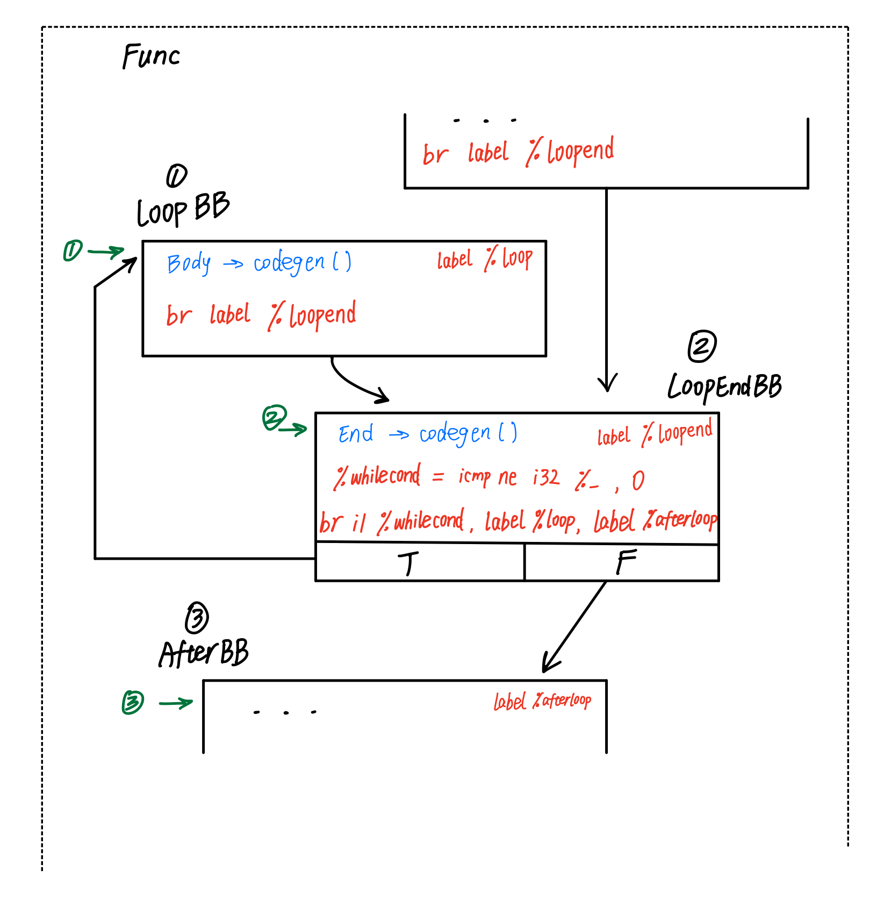

LLVM IR 的生成整体上采取 **macro expansion** 的手法。中间代码作为 AST 的 **综合属性**。

## Getting Started

我们使用 LLVM 提供的实用类 `IRBuilder`. 这使得我们不用手动管理插入中间代码的位置，同时指令选择更便利。IR 生成的接口如下

```c++
virtual Value *codegen() = 0;
```

- 它将为该 AST 节点调用 `IRBuilder` 插入中间代码
- 如果语义上该节点有一个“值”，例如对常数、变量的引用，则返回这个值的表示；否则返回值为空指针
- `Value` 表示一个类型化值，可以用作（但不限于）指令操作数。有许多不同类型的 `Values` ，例如 `Constants`, `Arguments`. 甚至 `Instructions` 和 `Functions` 都是 `Values`. 这一良好的类型层次给编码提供了很好的抽象。 `Value` 对象的生命周期由 LLVM 管理（并跟踪 `User` ），`Value` 类对外提供一个 `get` 静态方法返回 `Value *`

对于叶子节点，接口实现简单：

```c++
std::map<std::string, Value *> NamedValues; // a simple symtab
...
Value *NumberExprAST::codegen() {
  return Builder->getInt32(Val);
}

Value *VariableExprAST::codegen() {
  // Look this variable up in the function.
  Value *var = NamedValues[Name];
  // reference variable in memory
  return Builder->CreateLoad(Builder->getInt32Ty(), var, Name);
}
```

LLVM IR 要求 **静态单赋值** , 即：只允许带初值的变量声明，高级语言中的变量赋值不能够直接翻译，如下图所示。


我们使用 Clang 的实践：先把所有变量都视作内存变量（参考 *代码优化* 一节）。这解释了为什么上面的变量引用会发出 load 指令。对应地，变量赋值翻译为向内存存值

```c++
Value *VarAssignAST::codegen() {
  auto val = RHS->codegen();
  auto var = NamedValues[LHS->Name];
  Builder->CreateStore(val, var);
  ...
```

函数返回直接对应一条 IR.

```c++
Value *ReturnAST::codegen() {
  if (Value *RetVal = RHS->codegen()) {
    // Finish off the function.
    Builder->CreateRet(RetVal);
  ...
```

## 算术运算与关系运算

语言的主要能力是通过单目和双目运算符实现的。以双目运算符为例，codegen 时，首先对两个 操作数 做 codegen，并可以信任两个方法会返回 操作数 的值表示。然后枚举运算符

```c++
Value *BinaryExprAST::codegen() {
  Value *L = LHS->codegen();
  Value *R = RHS->codegen();

  if (Op == "+") {
    return Builder->CreateAdd(L, R, "addtmp");
  ...
```

处理关系运算符时，要遵守 SysY 的语言标准，应保证返回类型 i32 

```c++
    // relation op: i32 in {0, 1}
    auto it = srel2pred.find(Op);
    if (it != srel2pred.end()) {
      R = RHS->codegen();
      L = Builder->CreateICmp(it->second, L, R, "cmptmp");
      return Builder->CreateZExt(L, Builder->getInt32Ty(), "i1toi32_");
    }
```

## {Block} 嵌套作用域

以 BlockAST 囊括这些信息。BlockAST::items 表示了一对大括号内的所有声明/语句，codegen 时顺序生成。这样一来，符号表可以逐层嵌套

```c++
Value *BlockAST::codegen() {
  // new symtab for each scope
  auto symtab_stash = NamedValues;
  for (auto &&pAST : items) {
    pAST->codegen();
  }
  // restore symtab
  NamedValues = symtab_stash;
  return nullptr;
}
```

## 控制流

LLVM 用 `BasicBlock` 类做 IR 的基本容器，呼应汇编中的 *基本块* 概念 (a single entry single exit section of the code). 实现条件分支与循环，需要创建多个基本块，在其中分别插入适当的 IR ，并用 terminator instructions (可以简单理解为跳转) 连接这些基本块。

- `IRBuilder` 管理了当前插入 IR 的基本块，以及插入位置，称为 `InsertPoint`. 顺序生成 IR 时不需要考虑它，但切换基本块插入 IR 时需要 `SetInsertPoint`
- `BasicBlock` 最后必须用 `insertInto` 方法插入 `Function` 中。一串 `BasicBlock`s 组成了一个 `Function` 的 body.
- 使用 `CreateCondBr` 和 `CreateBr` 插入跳转指令





IfAST::codegen 和 WhileAST::codegen 显得有些冗长，但主要是因为要实现的过程有三四个步骤；方法所做的事情就是在当前函数体中插入上图所示的一个结构。如果思路清晰，是不难实现的。

### break 与 continue

LLVM IR 直接支持跳转到基本块，因此处理结构化的控制语句是简单的。我们利用 GotoAST 类来 cover 到 break 和 continue 语句。问题简化为在 GotoAST::codegen 时提供位置信息。采用了类似 python 魔术变量的 trick, 简单在 Body->codegen() 之前复制一份符号表，往里面塞了两个编译器内部使用的标签

```c++
Value *WhileAST::codegen() {
  ...entering
  // establish magic labels
  auto symtab_stash = NamedValues;
  NamedValues["__WEND__"] = AfterBB;
  NamedValues["__WHILE__"] = LoopBB;
  ...gen body
  // restore symtab
  NamedValues = symtab_stash;
```

```c++
Value *GotoAST::codegen() {
  if (auto *tgtBB = dyn_cast<BasicBlock>(NamedValues[label])) {
    Builder->CreateBr(tgtBB);
```

### 逻辑运算符 短路求值

短路求值即 **如果当前结果已能够确定逻辑运算式的真值，就不能继续求值右侧的操作数**。未实现短路求值的后果包括 意外的指针访问，全局变量改写，I/O调用 等。短路求值 可以改写成 **if-else** 的形式，如 `x && y` 等价于

```
if (evaluate x) is true
  then use (evaluate y)
  else use x
```

- 不能再像前面那样一开始一起求取两个操作数
- 与 IfAST::codegen 的逻辑类似
- 为了遵循 SSA 且不使用 alloca, 利用 PHI Node 根据控制来源，选择正确的值返回

```c++
Value *BinaryExprAST::codegen() {
  Value *L = LHS->codegen(), *R; // codegen of RHS postponed due to Logic Op
  ...
    } else {
      // logic op: short-circuit evaluation
      BasicBlock *EntryBB = Builder->GetInsertBlock();
      Value *CondV = Builder->CreateICmpNE(L, Builder->getInt32(0), "short");
      // ...Fill 'then' block
      R = RHS->codegen();
      R = Builder->CreateICmpNE(R, Builder->getInt32(0), "i32toi1_");
      Builder->CreateBr(MergeBB);
      // ...Finish merge block.
      PHINode *PN = Builder->CreatePHI(Builder->getInt1Ty(), 2, "logictmp");
      PN->addIncoming(CondV, EntryBB);
      PN->addIncoming(R, ThenBB);
      return Builder->CreateZExt(PN, Builder->getInt32Ty(), "i1toi32_");
```

## 数组支持

### 编译时常量求值

Short Answer: No need to DIY.

本来思考基于 递归匹配 + dynamic_cast 实现，手敲了一半，基本是在对常数重新实现加减乘除运算。后来发现这部分工作，其实在最开始实现单双目运算符时已经做了 Orz. LLVM 使用了一套自洽的，基于模板，高度优化的 RTTI 系统。一大福利是，实现了非常 **优雅** 的常数折叠：包含在 `IRBuilder` 创建指令的过程中了！

IRBuilder 示例 https://llvm.org/doxygen/IRBuilder_8h_source.html#l01603

```c++
   Value *CreateNot(Value *V, const Twine &Name = "") {
     if (auto *VC = dyn_cast<Constant>(V))
       return Insert(Folder.CreateNot(VC), Name);
     return Insert(BinaryOperator::CreateNot(V), Name);
   }
```

需要某个编译时可计算的常量时，先像一般的 Expr 节点一样调用codegen(), 再直接使用 LLVM RTTI 设施 cast 获得常数

### 数组声明

- 局部作用域的数组使用 alloca 创建

```c++
  // alloc stack space
  auto alloc = Builder->CreateAlloca(Builder->getInt32Ty(), len, vn.Name);
```

- 全局变量需要单独处理，创建 llvm::GlobalVariable
- 全局值一定要使用 ExternalLinkage. 为此花费了 2 hr debug

```c++
  // array: len must be constant
  auto len = cast<ConstantInt>(vn.len->codegen());
  auto ulen = len->getZExtValue();
  auto ArrTy = ArrayType::get(Builder->getInt32Ty(), ulen);
  // using zero initializer
  auto init_ref = std::vector<Constant *>(ulen, Builder->getInt32(0));
  if (vn.iv) {
    auto p = static_cast<BlockAST *>(vn.iv.get());
    for (int i = 0, e = p->items.size(), f = init_ref.size();
         i < e && i < f; i++) {
      // each must be constant
      init_ref[i] = cast<ConstantInt>(p->items[i]->codegen());
    }
  }
  gv = new GlobalVariable(
      *TheModule, ArrTy, isConst, GlobalVariable::ExternalLinkage,
      ConstantArray::get(ArrTy, ArrayRef<Constant *>(init_ref)), vn.Name);
```

### 数组索引

用到比较难的 GEP (get element ptr) 指令. 对于局部数组，可以类比 x86 asm lea 指令, 此时 alloca 是一个 i32* ；而全局变量非常坑，因为它总是一个指针；特别地，对于全局数组，它是 ArrayType* 而不是 i32*


这意味着 GEP 的 IdxList 事实上有两个元素: {0, idx->codegen()}


```c++
Value *VariableExprAST::codegen() {
  if (idx) {
    std::vector<Value *> Idx{};
    // cause: llvm gv is always a ptr (to ArrTy) while alloca simply ret i32*
    if (var->getType()->getContainedType(0)->isArrayTy()) {
      Idx.push_back(Builder->getInt32(0));
    }
    Idx.push_back(idx->codegen());
    var = Builder->CreateGEP(var, Idx, "arridx");
  }
  return Builder->CreateLoad(Builder->getInt32Ty(), var, Name);
}
```

## 代码优化

调用 LLVM 提供的优化 pass. 特别地，mem2reg pass 使用 *iterated dominance frontier* 算法消除我们之前无脑 alloca 出的变量


此外还使用了窥孔优化，表达式重排，公共子表达式消除与控制流简化。由于均是调 API, 不阐述原理了。

## 运行时环境

引入了官方教程的 JIT, 可以在内存中动态编译 SysY 源程序。同时使用动态链接库导出函数，为 SysY 提供 I/O 库。示例

```c++
#ifdef _WIN32
#define DLLEXPORT __declspec(dllexport)
#else
#define DLLEXPORT
#endif

extern "C" DLLEXPORT int getint() {
  int rv;
  scanf("%d", &rv);
  return rv;
}
```

LLVM JIT 和同一编译环境保证了 ABI 兼容


# 参考

## 教程

- https://llvm.org/docs/tutorial/MyFirstLanguageFrontend/index.html
- 二手中文 https://llvm-tutorial-cn.readthedocs.io/en/latest/index.html
- 系列 逐步讲解 https://www.bilibili.com/video/av626821579/

开发 & 测试

- LLVM IR 指令速学 https://zhuanlan.zhihu.com/p/64427829

## 参考

- 稍微友好一些 https://llvm.org/docs/ProgrammersManual.html
- https://llvm.org/docs/LangRef.html
- https://llvm.org/doxygen/classllvm_1_1IRBuilderBase.html
- mapping-high-level-constructs-to-llvm-ir.readthedocs.io

## 前人工作借鉴

- w/ English report: https://github.com/huangyangyi/Our-Pascal-Compiler
- 介绍了完整流水线 http://www.cppblog.com/woaidongmao/archive/2009/11/11/100693.aspx https://github.com/lsegal/my_toy_compiler
